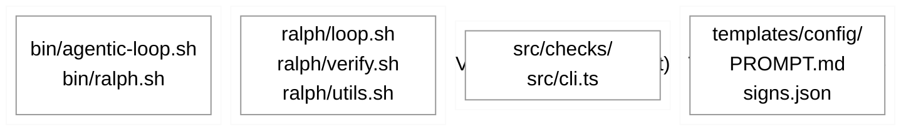
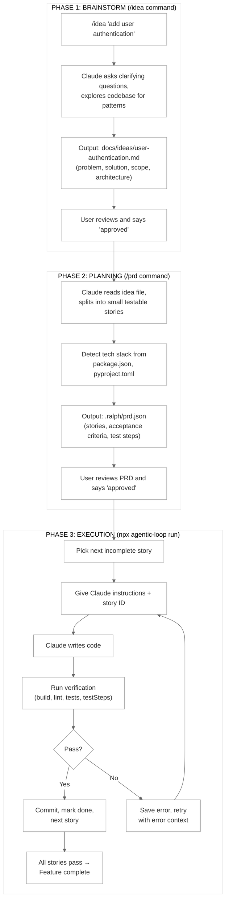
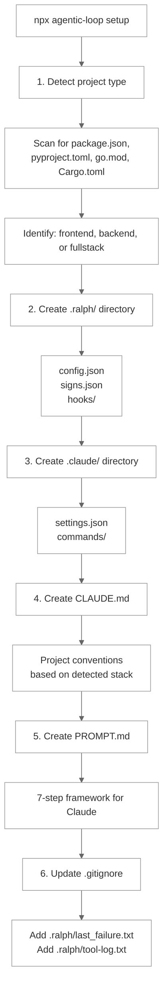
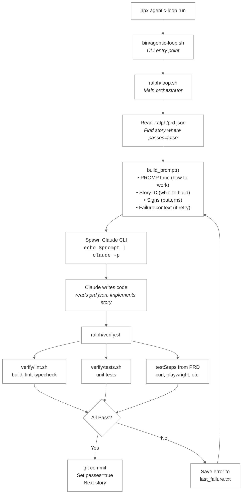
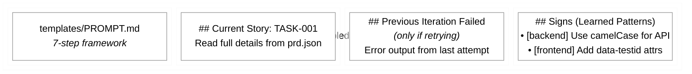

# Technical Architecture

Complete technical breakdown of the agentic-loop codebase.

## Table of Contents

1. [Overview](#overview)
2. [Idea to Execution Flow](#idea-to-execution-flow)
3. [Project Setup](#project-setup)
4. [System Flow](#system-flow)
5. [Entry Points](#entry-points)
6. [Core Loop](#core-loop)
7. [Verification Pipeline](#verification-pipeline)
8. [Prompt Assembly](#prompt-assembly)
9. [Slash Commands](#slash-commands)
10. [Claude Code Hooks](#claude-code-hooks)
11. [Vibe-Check Engine](#vibe-check-engine)
12. [Configuration](#configuration)
13. [Templates](#templates)
14. [Data Files](#data-files)

---

## Overview

Agentic-loop is a system that lets you describe a feature in plain English, have Claude Code break it into small tasks, then execute those tasks autonomously in a loop until everything works.

**The problem it solves:** Writing code with AI is great, but you still have to manually verify it works, fix errors, and iterate. Agentic-loop automates this entire cycle - Claude writes code, the system verifies it (builds, tests, linting), and if something fails, Claude automatically retries with the error context.

**How it's built:**



**Languages:**
- **Bash** - Core loop, verification, CLI (ralph/ directory)
- **TypeScript** - Static analysis tool called "vibe-check" (src/ directory)
- **Markdown** - Slash commands that Claude reads for instructions (.claude/commands/)
- **JSON** - Configuration, PRD (Product Requirements Document), learned patterns

---

## Idea to Execution Flow

This is the main user journey - from a rough idea to shipped, working code.

**Why this matters:** Most AI coding tools are single-shot - you prompt, get code, manually test it, prompt again. Agentic-loop creates a structured pipeline with checkpoints and automated verification.



### /idea Command (.claude/commands/idea.md)

The `/idea` command is a markdown file that Claude reads as instructions. When you type `/idea "feature"`, Claude follows these steps:

1. **Brainstorm** - Ask clarifying questions about scope, edge cases, UX
2. **Explore** - Use Glob/Grep to understand existing code patterns
3. **Write** - Create `docs/ideas/{feature}.md` with structured documentation
4. **Wait** - Stop and ask user to review and approve
5. **Delegate** - Call `/prd` command to generate the PRD

### /prd Command (.claude/commands/prd.md)

The `/prd` command generates the actual task list (PRD = Product Requirements Document). This is where the "single source of truth" lives - all schema definitions, testing requirements, and story format are defined here.

1. **Read input** - Either an idea file path or a direct description
2. **Detect tech stack** - Scan package.json, pyproject.toml, go.mod, Cargo.toml
3. **Split into stories** - Each story is atomic (frontend OR backend, not both)
4. **Generate testSteps** - Backend stories get `curl` commands, frontend gets `tsc --noEmit` + playwright
5. **Write PRD** - Output to `.ralph/prd.json`

### PRD Schema

The PRD is a JSON file that contains everything Claude needs to implement the feature:

```json
{
  "feature": {"name": "User Auth", "branch": "feature/user-auth", "status": "pending"},
  "techStack": {"frontend": "React 19, TypeScript", "backend": "Python, FastAPI"},
  "testing": {"approach": "TDD", "unit": {"backend": "pytest"}, "e2e": "playwright"},
  "globalConstraints": ["All API calls must have error handling"],
  "stories": [
    {
      "id": "TASK-001",
      "type": "backend",
      "title": "Add login endpoint",
      "passes": false,
      "files": {"create": ["src/api/auth.py"], "modify": ["src/api/routes.py"]},
      "acceptanceCriteria": ["POST /auth/login returns JWT on valid credentials"],
      "testSteps": ["curl -X POST {config.urls.backend}/auth/login -d '...' | jq .token"],
      "contextFiles": ["docs/ideas/user-auth.md"]
    }
  ]
}
```

### Key Design Decisions

- **Two approval gates**: User approves idea file, then approves PRD. Nothing runs without explicit approval.
- **Atomic stories**: Each story is frontend OR backend, never both. This makes testing clearer.
- **URL placeholders**: testSteps use `{config.urls.backend}` which gets replaced with actual URLs at runtime from config.json.
- **Lean prompts**: Instead of stuffing everything into the prompt, Claude reads files during execution. This improves comprehension.

---

## Project Setup

Before you can use agentic-loop, you need to set up your project. This is done once per project.

```bash
npx agentic-loop setup
```

### What Setup Does (ralph/setup.sh)

Setup detects your project type and configures everything:



### Setup Functions (ralph/setup.sh)

| Function | What it does |
|----------|--------------|
| `setup_ralph_dir()` | Create `.ralph/` with config.json, signs.json based on detected project type |
| `setup_gitignore()` | Add agentic-loop files to .gitignore |
| `setup_claude_hooks()` | Copy hooks to `.ralph/hooks/` and configure `.claude/settings.json` |
| `setup_slash_commands()` | Copy slash commands to `.claude/commands/` |
| `setup_claude_md()` | Generate CLAUDE.md with conventions for detected stack |
| `setup_mcp()` | Help configure MCP tools (Playwright, DevTools) |
| `setup_precommit_hooks()` | Set up pre-commit hooks for git |
| `setup_github_ci()` | Generate GitHub Actions workflows |

### Project Type Detection

Setup reads your project files to determine what config to use:

| Detected | Config Template Used |
|----------|---------------------|
| `package.json` only | `templates/config/node.json` |
| `pyproject.toml` or `requirements.txt` | `templates/config/python.json` |
| `go.mod` | `templates/config/go.json` |
| `Cargo.toml` | `templates/config/rust.json` |
| Both frontend and backend | `templates/config/fullstack.json` |
| Nothing detected | `templates/config/minimal.json` |

### Generated config.json

Based on detection, setup creates `.ralph/config.json`:

```json
{
  "directories": {
    "frontend": ".",           // or "apps/web" for monorepos
    "backend": "."             // or "apps/api" for monorepos
  },
  "urls": {
    "frontend": "http://localhost:3000",
    "backend": "http://localhost:8000"
  },
  "checks": {
    "build": true,
    "lint": true,
    "test": true
  }
}
```

The URLs in config.json are what `{config.urls.backend}` expands to in testSteps.

---

## System Flow

Once you run `npx agentic-loop run`, here's what happens inside the system:



---

## Entry Points

These are the files that get executed when you run commands.

### bin/agentic-loop.sh

The main CLI. When you run `npx agentic-loop <command>`, this script routes to the right handler:

| Command | Handler | What it does |
|---------|---------|--------------|
| `setup` | `ralph/setup.sh` | First-time project setup (copies hooks, config, etc.) |
| `run` | `ralph/loop.sh` | Start the autonomous coding loop |
| `stop` | Sets a flag file | Gracefully stop after current story finishes |
| `status` | `ralph/loop.sh` | Show which stories have passed/failed |
| `check` | `ralph/verify.sh` | Run verification without Claude (useful for debugging) |
| `verify TASK-001` | `ralph/verify.sh` | Verify a specific story |
| `test` | `ralph/test.sh` | Run full test suite (like CI would) |
| `signs` | `ralph/signs.sh` | List/add/remove learned patterns |
| `ci install` | `ralph/ci.sh` | Generate GitHub Actions workflow files |

### bin/vibe-check.js

Standalone code quality checker. Can be run independently of the main loop:

```bash
npx vibe-check              # Check current directory
npx vibe-check src/         # Check specific path
npx vibe-check --json       # Output as JSON (for CI)
```

---

## Core Loop

The heart of the system - the code that actually runs Claude in a loop.

### ralph/loop.sh

This is the main orchestrator (~600 lines of Bash). Key functions:

| Function | What it does |
|----------|--------------|
| `run_loop()` | Main loop that iterates through stories until all pass or max iterations hit |
| `process_story()` | Handle one story: build prompt, run Claude, verify, handle result |
| `build_prompt()` | Assemble the text that gets piped to Claude |
| `run_claude()` | Actually spawn the Claude CLI process |
| `handle_result()` | If pass: commit + mark done. If fail: save error for retry |

**Session continuity**: Claude has context windows. For the first story, we start fresh. For subsequent stories, we use `--continue` so Claude remembers what it built:

```bash
# First story - fresh session
echo "$prompt" | claude -p --dangerously-skip-permissions

# Story 2, 3, etc. - continue existing session
echo "$delta_prompt" | claude --continue -p --dangerously-skip-permissions
```

### ralph/utils.sh

Shared utilities that all scripts source. Includes:

| Function | Purpose |
|----------|---------|
| `get_config "key" "default"` | Read value from config.json, with fallback |
| `log_progress "message"` | Append timestamped entry to progress.txt |
| `create_temp_file ".ext"` | Create temp file that auto-cleans on exit |
| `safe_exec "command" log_file` | Run command with timeout, capture output |
| `print_success/error/warning` | Colored terminal output |

---

## Verification Pipeline

After Claude finishes coding, we need to verify the code actually works. This is crucial - without verification, Claude might write plausible-looking code that doesn't actually run.

### ralph/verify.sh

Orchestrates the verification steps in order. If any step fails, the whole verification fails:

```bash
run_verification() {
    verify_lint "$story" || return 1      # Must pass before continuing
    verify_tests "$story" || return 1     # Must pass before continuing
    verify_prd_criteria "$story" || return 1  # Custom test steps
}
```

### ralph/verify/lint.sh

Build and lint checks. Auto-detects your tooling:

| Function | What it runs |
|----------|--------------|
| `run_auto_fix()` | `eslint --fix`, `ruff --fix`, `gofmt` - auto-fix simple issues |
| `run_build()` | `npm run build`, `cargo build`, etc. - must compile |
| `run_lint()` | `npm run lint`, `ruff check` - code style |
| `run_typecheck()` | `tsc --noEmit`, `mypy` - type errors |

### ralph/verify/tests.sh

Test execution. The key function is `verify_prd_criteria()` which runs the testSteps from the PRD:

```bash
verify_prd_criteria() {
    # Read testSteps from prd.json for this story
    # Expand URL placeholders: {config.urls.backend} → http://localhost:8000
    # Run each step, fail if any fails
}
```

**URL expansion**: testSteps can use `{config.urls.backend}` and `{config.urls.frontend}` which get replaced with actual values from config.json. This keeps the PRD portable across environments.

---

## Prompt Assembly

When we run Claude, we need to tell it what to do. But we don't want to dump thousands of tokens of context - that leads to Claude ignoring important details.

### The "Lean Prompt" Approach

Instead of injecting everything into the prompt, we give Claude minimal instructions and let it read files during execution. This is inspired by [Anthropic's guidance on long-running agents](https://www.anthropic.com/engineering/effective-harnesses-for-long-running-agents).

**What we inject** (small, ~500 tokens):
- `templates/PROMPT.md` - The 7-step framework ("how to work")
- Story ID (e.g., "TASK-001") - Just the ID, not the full story
- Signs - Learned patterns to follow
- Failure context - If retrying, include the error

**What Claude reads during Orient step** (Claude actively reads these):
- `.ralph/prd.json` - Full story details, tech stack, constraints
- `story.contextFiles[]` - Idea files, styleguides, mockups
- `CLAUDE.md` - Project conventions
- `.ralph/signs.json` - Full list of patterns

### build_prompt() in ralph/loop.sh

This function assembles the prompt text:



### templates/PROMPT.md

The 7-step framework Claude follows:

1. **Orient** - Read prd.json, find your story, read contextFiles
2. **Check for Failures** - If last_failure.txt exists, read it and understand what went wrong
3. **Read Learned Patterns** - Read signs.json, follow these strictly
4. **Verify Prerequisites** - Make sure servers are running, dependencies installed
5. **Implement** - Write code according to acceptanceCriteria
6. **Verify** - Run the testSteps, use browser tools if specified
7. **End Clean** - Update progress.txt, no debug statements left behind

---

## Slash Commands

Claude Code has a feature called "slash commands" - markdown files in `.claude/commands/` that Claude reads as instructions when you type `/commandname`.

### How They Work

When you type `/idea "add auth"` in Claude Code:
1. Claude looks for `.claude/commands/idea.md`
2. Claude reads the entire file as instructions
3. Claude follows those instructions with your input ("add auth")

### Available Commands

| File | Command | What it does |
|------|---------|--------------|
| `idea.md` | `/idea` | Brainstorm feature → write idea file → call /prd |
| `prd.md` | `/prd` | Generate PRD from idea file (single source of truth for schema) |
| `review.md` | `/review` | Security-focused code review (OWASP top 10) |
| `vibe-check.md` | `/vibe-check` | Quick code quality audit |
| `sign.md` | `/sign` | Add a learned pattern |
| `explain.md` | `/explain` | Explain code line by line |
| `styleguide.md` | `/styleguide` | Generate UI component reference page |
| `my-dna.md` | `/my-dna` | Set up personal coding preferences |
| `tour.md` | `/tour` | Interactive walkthrough of the system |

---

## Claude Code Hooks

Hooks are shell scripts that run during Claude's operation. They can warn about issues or block problematic changes.

### Why Hooks?

Claude sometimes does things you don't want:
- Writes `console.log` everywhere
- Hardcodes API keys
- Marks a story as "passed" when it shouldn't

Hooks catch these in real-time as Claude works.

### Hook Types

**PreToolUse** - Runs BEFORE Claude uses a tool. Can block the action.

| Hook | Triggers on | What it does |
|------|-------------|--------------|
| `protect-prd.sh` | Edit, Write | Blocks Claude from marking `passes: true` in prd.json |

**PostToolUse** - Runs AFTER Claude uses a tool. Can warn but not block.

| Hook | Triggers on | What it does |
|------|-------------|--------------|
| `warn-debug.sh` | Edit, Write | Warns if code contains console.log, debugger, print() |
| `warn-secrets.sh` | Edit, Write | Warns if code contains API keys, passwords |
| `warn-urls.sh` | Edit, Write | Warns if code contains hardcoded localhost URLs |
| `warn-empty-catch.sh` | Edit, Write | Warns on empty catch blocks |
| `log-tools.sh` | Any tool | Logs all tool usage to tool-log.txt |

### Hook Protocol

Hooks receive JSON on stdin describing what Claude is trying to do:

```json
{
  "tool_name": "Edit",
  "tool_input": {
    "file_path": "/path/to/file.ts",
    "old_string": "...",
    "new_string": "..."
  }
}
```

Hooks output JSON:
```json
{"continue": true}                     // Allow the action
{"continue": true, "message": "..."}   // Allow with warning shown to Claude
// Exit code 2 = Block the action entirely
```

---

## Vibe-Check Engine

A TypeScript-based static analysis tool that scans code for common AI-generated issues.

### Why TypeScript?

Bash is great for orchestration but painful for parsing code. The vibe-check engine is written in TypeScript for:
- Proper regex support
- Easy pattern matching
- JSON output for CI integration

### Source Structure

```
src/
├── cli.ts              # Command-line interface
├── index.ts            # Programmatic API (can be imported)
├── checks/
│   ├── index.ts        # Registry of all checks
│   ├── check-secrets.ts
│   ├── check-debug-statements.ts
│   ├── check-hardcoded-urls.ts
│   └── ... (16 checks total)
└── utils/
    ├── file-reader.ts  # Read and parse files
    ├── patterns.ts     # Regex patterns for detection
    ├── reporters.ts    # Format output (text, JSON)
    └── types.ts        # TypeScript type definitions
```

### Check Interface

Each check is a module that exports:

```typescript
interface Check {
  name: string;           // e.g., "check-secrets"
  description: string;    // Human-readable description
  run(files: FileContent[]): CheckResult[];
}

interface CheckResult {
  file: string;           // Which file
  line: number;           // Which line
  message: string;        // What's wrong
  severity: 'error' | 'warning';
  code: string;           // The problematic code snippet
}
```

### Available Checks

| Check | Severity | What it catches |
|-------|----------|-----------------|
| `check-secrets` | error | API keys, passwords, tokens in code |
| `check-hardcoded-urls` | error | localhost URLs that should be env vars |
| `check-debug-statements` | warning | console.log, print(), debugger |
| `check-empty-catch` | warning | catch blocks that swallow errors |
| `check-any-types` | warning | TypeScript `any` usage |
| `check-todo-fixme` | warning | TODO/FIXME comments left behind |
| `check-unsafe-html` | error | innerHTML with user-provided data (XSS risk) |
| `check-function-length` | warning | Functions longer than 50 lines |
| `check-deep-nesting` | warning | Code nested more than 4 levels deep |

---

## Configuration

### .ralph/config.json

Project-specific settings. Created during `npx agentic-loop setup`.

```json
{
  "directories": {
    "frontend": "apps/web",      // Where frontend code lives
    "backend": "apps/api"        // Where backend code lives
  },
  "urls": {
    "frontend": "http://localhost:3000",  // For {config.urls.frontend}
    "backend": "http://localhost:8000"    // For {config.urls.backend}
  },
  "checks": {
    "build": true,               // Run build check?
    "lint": true,                // Run lint check?
    "test": true,                // Run tests? (true, false, or "final")
    "testCommand": "pytest -x",  // Custom test command (or auto-detect)
    "requireTests": false        // Fail if new files don't have tests?
  },
  "maxIterations": 20,           // Give up after this many retries
  "maxSessionSeconds": 600       // Timeout per story (10 minutes)
}
```

### .claude/settings.json

Configures Claude Code hooks:

```json
{
  "hooks": {
    "PreToolUse": [
      {"matcher": "Edit|Write", "command": ".ralph/hooks/protect-prd.sh"}
    ],
    "PostToolUse": [
      {"matcher": "Edit|Write", "command": ".ralph/hooks/warn-debug.sh"},
      {"matcher": "Edit|Write", "command": ".ralph/hooks/warn-secrets.sh"}
    ]
  }
}
```

---

## Templates

Files that get copied to projects during setup.

### templates/config/

Different default configs for different project types:

| Template | When it's used |
|----------|----------------|
| `node.json` | Detected package.json with no Python |
| `python.json` | Detected pyproject.toml or requirements.txt |
| `go.json` | Detected go.mod |
| `rust.json` | Detected Cargo.toml |
| `fullstack.json` | Detected both frontend and backend |
| `minimal.json` | Fallback if nothing detected |

### templates/examples/

Example CLAUDE.md files showing coding conventions for different stacks:

- `CLAUDE-react.md` - React/TypeScript frontend
- `CLAUDE-node.md` - Node.js backend
- `CLAUDE-fastapi.md` - Python FastAPI
- `CLAUDE-django.md` - Python Django
- `CLAUDE-fullstack.md` - Combined frontend + backend

### templates/signs.json

Default learned patterns every project starts with:

```json
{
  "signs": [
    {"pattern": "Never hardcode AI model names - use config", "category": "backend"},
    {"pattern": "Use environment variables for secrets", "category": "general"},
    {"pattern": "Handle loading, error, and empty states in UI", "category": "frontend"},
    {"pattern": "Add data-testid attributes for e2e testing", "category": "frontend"},
    {"pattern": "When removing UI elements, update related tests", "category": "testing"}
  ]
}
```

### templates/PROMPT.md

The 7-step framework that Claude follows. This is the "how to work" instructions.

---

## Data Files

Files that get created/modified during operation.

### .ralph/prd.json

The PRD (Product Requirements Document). Contains:
- Feature metadata (name, branch, status)
- Tech stack (auto-detected)
- Testing configuration
- Global constraints (rules for all stories)
- Stories array (the actual tasks)

Schema is defined in `.claude/commands/prd.md`.

### .ralph/signs.json

Learned patterns. These get injected into every prompt so Claude doesn't repeat mistakes:

```json
{
  "signs": [
    {
      "id": "sign-001",
      "pattern": "Always use camelCase for API response fields",
      "category": "backend",
      "learnedFrom": "TASK-003"
    }
  ]
}
```

Add new signs: `npx agentic-loop sign "pattern" category`

### .ralph/progress.txt

Activity log with timestamps:

```
2024-01-15 10:30:00 | START  | TASK-001 | Create dashboard
2024-01-15 10:35:00 | CLAUDE | TASK-001 | Session started
2024-01-15 10:41:00 | PASS   | TASK-001 | All checks passed
2024-01-15 10:41:00 | COMMIT | TASK-001 | feat(TASK-001): Create dashboard
```

### .ralph/last_failure.txt

When verification fails, the error output is saved here. On retry, this gets included in the prompt so Claude knows what went wrong.

### .ralph/tool-log.txt

If the `log-tools.sh` hook is enabled, logs every tool Claude uses:

```
2024-01-15 10:35:15 | Read   | src/components/Dashboard.tsx
2024-01-15 10:35:20 | Edit   | src/components/Dashboard.tsx
2024-01-15 10:36:00 | Bash   | npm test
```
